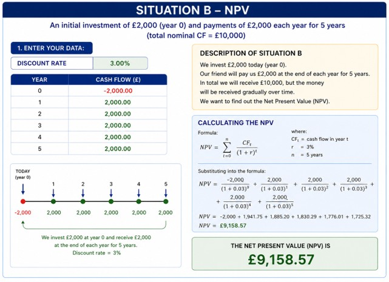

# Net Present Value (NPV) Explained in Simple Terms
Aneta Paciorek, MAAT, ACCA Part-Qualified
22.05.2026

## 1. Introduction

If you are reading this article, you have probably already read the section about Present Value (PV). If not, I invite you to read the previous article available on GitHub:
Present Value Explained Simply – GitHub.

Today, students of finance, economics, and related fields are expected not only to possess theoretical knowledge, but also practical analytical skills, an understanding of financial modelling, and the ability to interpret business data.
That is exactly why this series of articles was created. Its purpose is to explain fundamental financial concepts in a simple, practical, and easy-to-understand way. It is intended for people who want to move beyond academic theory, start experimenting with financial modelling, and better understand how finance works in real business situations.
This series is aimed particularly at individuals beginning their journey in finance, FP&A, business analysis, or financial modelling — before the job market starts expecting years of professional experience from them.

 ## 2. What is Net Present Value (NPV)?

Today’s article is dedicated to the concept of NPV, which stands for Net Present Value — the present value of future cash flows.

NPV shows how much value an investment adds after taking into account both the initial investment cost and the time value of money.

 

	 
 

  
To better understand this concept, let us imagine two situations.

##### Situation A

We meet with a very good friend of ours. He is a highly capable, hardworking, and responsible person with financial stability. He asks us to invest £2,000 in his new business today. In return, he promises a one-time payment of £10,000 after 5 years.

##### Situation B

The same friend offers a different solution. Instead of a single payment after 5 years, he will pay us £2,000 per year for the next 5 years in exchange for investing £2,000 in his business today. In total, we will still receive £10,000 in cash flow, but the money will be received gradually each year.
Looking at these two situations, an important question arises:
Which option is financially more beneficial?
Is it better to invest £2,000 today and receive £10,000 after 5 years, or to invest £2,000 today and receive £2,000 every year for the next 5 years?
These are exactly the types of questions that the concept of Net Present Value (NPV) helps answer.

## 3. Discount Rate

To solve our problem and compare both situations, we first need to determine an appropriate discount rate, expressed as a percentage (%). It is the discount rate that allows us to determine how much less future money is worth compared to money available today.
The discount rate can be understood as the cost of time, the cost of risk, and the loss of money’s value over time. It also takes into account the fact that money received today could be invested and generate additional profit in the future.

In practice, the discount rate also depends on:

    * the type of industry, 
	* the level of project risk, 
	* economic conditions, 
	* and alternative investment opportunities. 

Simply put, the discount rate can be described as:
                
##### “a reduction in the value of the future already applied today.”
				  
The higher the discount rate, the greater the risk and the lower the value of future cash flows. On the other hand, a lower discount rate means lower risk and a higher present value of future money.

The discount rate therefore shows how much future money loses value because of:

    * the passage of time, 
	* risk, 
	* inflation, 
	* alternative investment opportunities. 

## 4. Calculation

Let us assume that our friend is reliable, trustworthy, and hardworking. We trust him and are almost certain that he will keep his promise. Therefore, we can assume a relatively low discount rate of 3%.

It is important to emphasize that such a low discount rate is often associated with very safe projects — for example, government or infrastructure projects — where the risk of default or bankruptcy is relatively low. In a way, by using such a low discount rate, we trust our friend almost as much as investors trust a government paying returns on treasury bonds.

Of course, in real-world finance, higher risk would usually result in a higher discount rate. However, in our example, we assume that:

    * our friend is credible, 
	* he has a stable financial situation, 
	* he is responsible, 
	* and the probability that he will fail to keep his promise is very low. 

Therefore, for our further calculations, we will assume: 

* "Discount Rate"=3%

 

	 
 

 

	 
 

Now we can move on to calculating the Net Present Value (NPV) for both situations and determine which option is financially more beneficial.

Despite having the same nominal cash flow, Situation B generates a higher Net Present Value.

## 5. Why Do Companies Use NPV?

Net Present Value (NPV) is one of the most important methods used in finance and business. Companies use NPV because it helps determine whether an investment will truly generate value and profit after taking into account both the investment cost and the time value of money.

NPV helps convert future cash flows into their present value and then compare them with the initial investment cost.

If:

    * NPV > 0 → the investment potentially generates profit, 
	* NPV = 0 → the investment earns exactly the cost of capital, 
	* NPV < 0 → the investment may be unprofitable. 

###  Investment Evaluation

Companies often analyse whether a particular investment will be profitable. NPV allows future financial benefits to be compared with costs incurred today. This helps determine whether a project makes economic sense and whether it will increase the company’s value.

###  Company and Startup Valuation

Business valuation is largely based on forecasted future cash flows. NPV helps determine how much those future cash inflows are worth today after considering both risk and time.

This method is widely used in:

    * startup valuation, 
	* company acquisitions, 
	* venture capital analysis, 
	* DCF (Discounted Cash Flow) models. 

### Loans and Leasing

Banks and financial institutions use discounting mechanisms to calculate the value of loans, lease payments, and other financial products. In practice, most financial instruments are based on analysing the present value of future payments.

### Business Project Analysis

Companies regularly analyse different investment projects, such as:

   * building new factories, 
   * purchasing machinery, 
   * technology investments, 
   * expansion into new markets. 

NPV helps determine whether future financial benefits will outweigh investment costs and whether a project will increase the value of the business.

Examples of practical NPV applications include:

  * purchasing new machinery, 
  * building factories, 
  * IT investments, 
  * purchasing rental properties, 
  * startup valuation. 

### Real Estate

Real estate investors use NPV to evaluate future rental income and the potential future selling value of a property. This helps assess whether a property investment is financially worthwhile.

### Financial Modelling and FP&A

In FP&A (Financial Planning & Analysis) departments, NPV is one of the foundations of financial modelling, forecasting, and scenario analysis.

Analysts use NPV for:

  * forecasting, 
  * budgeting, 
  * project valuation, 
  * risk analysis, 
  * strategic decision-making, 
  * investment profitability assessment. 

It can therefore be said that Net Present Value (NPV) is one of the foundations of modern finance, investment analysis, and business decision-making.

## 6. Conclusion

Situation B turns out to be financially more beneficial. Why? Because we receive money gradually starting from the first year, rather than waiting until the end of year 5. This means the funds become available to us earlier and can be additionally used — for example, invested, saved, or allocated toward business growth.

In Situation A, we must wait 5 years for a single payment of £10,000. During that time, money loses part of its value due to the time value of money. Additionally, we lose the opportunity to use those funds earlier.

Although the nominal cash flow in both cases equals £10,000, their Net Present Value (NPV) is different. Receiving money gradually over time is more valuable than receiving the same amount only in the future.
That is why:

	^ the NPV of Situation B is higher than the NPV of Situation A, 
	^ earlier cash flows are more valuable, 
	^ the timing of receiving money is extremely important in finance, 
	^ the opportunity to invest money earlier increases the value of a project. 

This demonstrates why, in business and finance, it is important not only how much money we receive, but also when we receive it. In practice, two projects may generate the same nominal profit, yet the project providing earlier cash flows will usually be financially more attractive.
It can therefore be said that Net Present Value (NPV) is one of the foundations of modern finance, investment analysis, and business decision-making.
NPV is a highly useful tool; however, its result depends on the quality of forecasted cash flows and the selected discount rate. This means that even correctly performed calculations may lead to poor decisions if the project assumptions turn out to be unrealistic.

