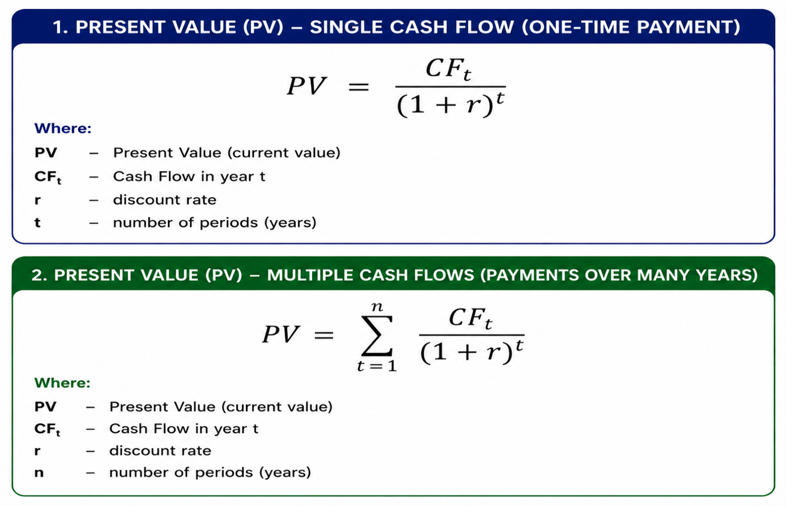

# Present Value (PV) Explained in Simple Terms
Aneta Paciorek, MAAT, ACCA Part-Qualified
20.05.2026

## 1. Introduction
Many students of finance, economics, and related fields graduate after several years of study with strong theoretical knowledge and high hopes for a successful career start. However, during their very first job interviews, they often discover that theory alone is not enough. Employers expect practical experience, analytical skills, Financial Modeling knowledge, and the ability to interpret business data.
That is exactly why this article series was created. Its purpose is to explain fundamental financial concepts in a simple, practical, and easy-to-understand way. It is aimed at people who want to go beyond academic theory, start experimenting with Financial Modeling, and better understand how finance works in real business situations.
This series is especially intended for individuals beginning their journey in finance, FP&A, business analysis, or Financial Modeling — before the job market starts demanding years of professional experience.

## 2. What is Present Value (PV)?
Today’s article focuses on the concept of PV, which stands for Present Value — the current value of money that will be received in the future.
To better understand this concept, let us imagine two different situations.
 
To better understand this concept, let us imagine two different situations.

Situation A
A friend of ours — a very intelligent, hardworking, and trustworthy person — comes to us and says that, as a thank you for some help we once gave him, he will give us £10,000 in 5 years’ time. The help does not necessarily have to be financial — it could have been helping him move house, mowing his lawn, or assisting him with something important. The key point is that he promises us a one-time payment of £10,000 after 5 years.

Situation B
The same friend offers us a different arrangement. Instead of making one payment in 5 years, he will pay us £2,000 every year for the next 5 years. In total, we will still receive £10,000 of cash flow, but the money will be received gradually over time.
Looking at these two situations, an important question arises:
	Which option is financially more beneficial? 
	Is £10,000 received in 5 years worth the same as receiving £2,000 every year for 5 years? 
These are exactly the types of questions that the concept of Present Value (PV) helps answer.

## 3. Discount Rate
To solve our problem and compare both situations, we first need to determine an appropriate discount rate, expressed as a percentage (%). The discount rate allows us to estimate how much less future money is worth compared to money available today.
The discount rate can be understood as:
	the cost of time, 
	the cost of risk, 
	the loss of money value over time. 
It also reflects the fact that money received today could potentially be invested and generate additional returns in the future.
In practice, the discount rate depends on many factors, including:
	the type of industry, 
	the level of project risk, 
	economic conditions, 
	alternative investment opportunities. 
Simply put, the discount rate is a kind of:
“future discount applied today.”
The higher the discount rate, the greater the risk and the lower the value of future cash flows. On the other hand, a lower discount rate indicates lower risk and a higher present value of future money.
Therefore, the discount rate shows how much future money loses value because of:
	the passage of time, 
	risk, 
	inflation, 
	alternative investment opportunities.

## 4. Calculation
Let us assume that our friend is reliable, trustworthy, and hardworking. We trust him and are almost certain that he will keep his promise. Because of this, we can assume a relatively low discount rate of 3%.
Such a discount rate is often associated with very safe projects — for example government or infrastructure projects — where the risk of bankruptcy or non-payment is relatively low. We could say that we trust our friend almost as much as investors trust government bonds.
Of course, in real finance, higher risk would normally result in a higher discount rate. However, in our example, we assume that:
	our friend is financially reliable, 
	he has a stable financial situation, 
	he is responsible, 
	and the probability that he fails to keep his promise is very low. 
Therefore, for our calculations, we will assume:
Discount Rate=3%
Now we can move on to calculating the Present Value for both situations and determine which option is financially more beneficial.

 

 
Despite having the same nominal cash flow, Situation B generates a higher Present Value.

## 5. Why Do Companies Use Present Value (PV)?
Present Value (PV) is one of the most important concepts used in finance and business. Companies use PV because it helps determine how much future money is actually worth today. This allows businesses to make more rational and profitable financial decisions.
• Investment Evaluation
Companies often analyze whether a particular investment will be profitable. PV allows them to compare future profits with costs incurred today. As a result, businesses can assess whether a project makes financial sense.
• Company and Startup Valuation
Business valuation is largely based on projected future cash flows. PV helps convert those future cash inflows into their current value.
• Loans and Leasing
Banks and financial institutions use PV to calculate the value of loans, lease payments, and interest rates. In practice, most financial products are based on discounting future payments.
• Business Project Analysis
Companies regularly evaluate different types of projects, such as:
	building new factories, 
	purchasing machinery, 
	technology investments, 
	expansion into new markets. 
PV helps determine whether future benefits outweigh the costs of the investment.
• Real Estate
Real estate investors use PV to estimate the value of future rental income and the potential future sale value of properties.
• Financial Modeling and FP&A
In FP&A (Financial Planning & Analysis) departments, PV is a fundamental part of financial modeling, forecasting, and scenario analysis. Analysts use PV for:
	forecasting, 
	budgeting, 
	project valuation, 
	risk analysis, 
	strategic decision-making. 
Therefore, it can be said that Present Value is one of the foundations of modern finance and business.

## 6. Conclusion
From a financial perspective, Situation B turns out to be the more beneficial option. Why? Because we receive the money gradually starting from the first year instead of waiting 5 years for a single payment. This means the money reaches our pocket earlier and can be additionally used — for example invested, saved, or spent on other opportunities.
In Situation A, we must wait 5 years to receive the one-time payment of £10,000. During that time, money loses value, and we also lose the opportunity to use those funds earlier.
Although both situations generate the same nominal cash flow of £10,000, their Present Value is different. Receiving money gradually over time is more valuable than receiving the same amount only in the future.
That is why:
	the PV of Situation B is higher than the PV of Situation A, 
	earlier cash flows are more valuable, 
	time and investment opportunities play a major role in finance. 
This demonstrates why, in business and finance, it is important not only how much money we receive, but also when we receive it.

## PV Formula example

